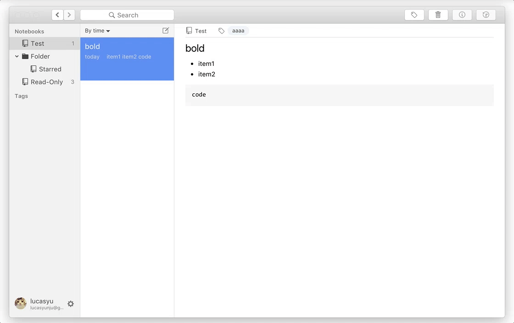
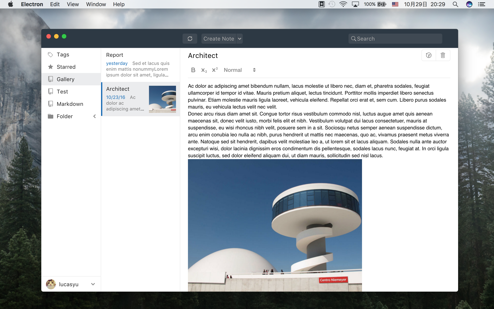

# leanote-desktop-lite

leanote-desktop-lite是[Leanote](https://github.com/leanote/leanote)的第三方客户端，主要特点

- Markdown实时预览，类似Typora的markdown写作体验
- 全新的UI，模仿原生应用的界面和交互
- 基于React + Redux，降低了开发和维护成本

本应用是简化版的客户端，**只支持markdown笔记**，只支持Leanote核心的功能。

应用版本还不到1.0.0，欢迎下载尝试，欢迎fork和pull request。

## How it looks

GIF

Screenshot

## Installation

[Releases](https://github.com/LucasYuNju/leanote-desktop-lite/releases)

## Getting started

1. `npm install`

> To bypass GFW, please change npm registry before installation： 
> `npm config set registry 'https://registry.npm.taobao.org'`

2. `npm start`

## Docs

[auto-markdown implementation](docs/auto-markdown.md)

## Features
- [x] Note CRUD, move
- [x] Data sync
- [x] Editor: header, list, bold, italic, code, link
- [x] App incremental update
- [x] Tag recommendation
- [x] Route and navigation
- [ ] Editor: Image, paste Image
- [ ] Upload tag with Leanote api

## License

[MIT](https://github.com/eggjs/egg/blob/master/LICENSE)
