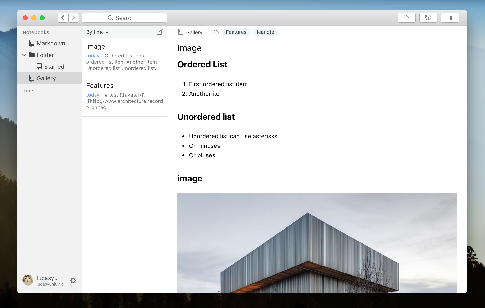

现在的笔记应用很多，但是都做不到类似Typora的markdown写作体验。
leanote-desktop-lite，是[Leanote](https://github.com/leanote/leanote)的第三方客户端，主要特点

- Markdown实时预览，不再需要Markdown预览窗口，基于Slate编辑器框架
- 全新的UI，模仿原生应用的界面和交互
- 基于React + Redux，React比较适合这样的单页面应用，降低了开发和维护成本

由于精力有限，本应用**只支持markdown笔记**，只做核心的功能。目前的应用版本还没到1.0.0，欢迎下载尝试，但目前不推荐使用。
如果对本应用感兴趣的话，欢迎fork和pull request。

## How it looks

GIF

Screenshot

## Installation

[Releases](https://github.com/LucasYuNju/leanote-desktop-lite/releases)

## Getting started

1. `npm install`

> To bypass GFW, please change npm registry first： 
> `npm config set registry 'https://registry.npm.taobao.org'`

2. `npm run dev`

>  preoblem with 由于Atom的terminal plus插件的问题，Mac用户目前只能在系统terminal上运行这条命令

## Docs

[auto-markdown](docs/auto-markdown.md)
[redux-state](docs/redux-store.md)

## TODOS

- [ ] Paste Image
- [ ] Keyboard actions
- [ ] Leanote Tag api

## License

[MIT](https://github.com/eggjs/egg/blob/master/LICENSE)
